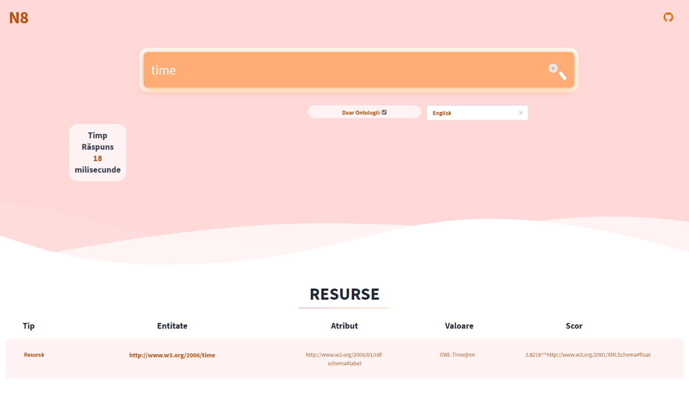
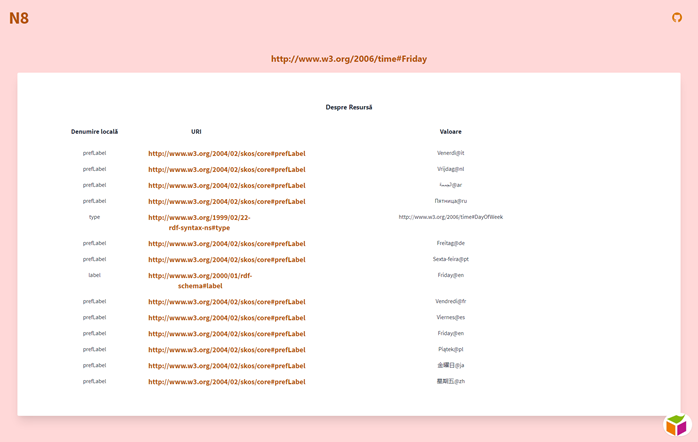

# n8-engine
Semantic Search engine

## Description

N8 is a search engine that performs indexing and searches in semantic documents, based on fields with literal values. The documents that work with this search engine are semi-structured, encoded in the Resource Description Framework format (a format that provides a standard for merging and creating semantic links between ontological resources in Semantic Web).

## Screenshots
### Frontpage


### Results


## Usage

Make a curl request to this endpoint with a search query to retrieve RDF documents:
```
 curl -d '{ "searchQuery":"bees","searchType":"ALL", "language": "en"}' \
      -X POST \
      localhost:8080/api/search
```
